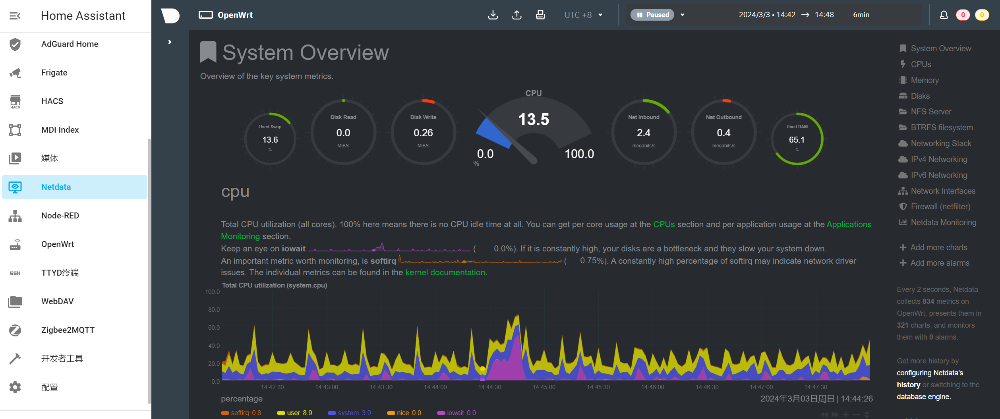

# hass_ingress


Hass.io provides a very nice feature called [Hass.io Ingress](https://www.home-assistant.io/blog/2019/04/15/hassio-ingress/), `hass_ingress` extracts this feature into a standalone integration, it allows you to add additional ingress panels to your Home Assistant frontend. The panels are listed in the sidebar and can contain external resources like the web frontend of your router, your monitoring system, or your media server. Home Assistant will take care of the authentication and the secure connection, so users can access the external resources without extra login.



## Install

You can install this custom component by adding this repository (https://github.com/lovelylain/hass_ingress) to HACS in the settings menu of HACS first. You will find the custom component in the integration menu afterwards, look for `Ingress`. Alternatively, you can install it manually by copying the custom_component folder to your Home Assistant configuration folder.

## Configuration

To enable Ingress panels in your installation, add the following to your `configuration.yaml` file:

```yaml
ingress:
  mdiindex:
    ingress: false
    title: MDI Index
    icon: mdi:vector-square
    url: /local/home-assistant-mdi/home-assistant-mdi.html
  frigate:
    title: Frigate
    icon: mdi:cctv
    url: http://172.30.32.2:5000
  go2rtc:
    toolbar: true
    parent: mdiindex
    title: go2rtc
    icon: mdi:camera-wireless
    url: http://172.30.32.2:1984
  nodered:
    require_admin: true
    title: Node-RED
    icon: mdi:sitemap
    url: http://127.0.0.1:45180
    headers:
      authorization: !secret nodered_auth
```

After you modify the Ingress configuration, you can go to `developer-tools` page and click `Reload Ingress` to reload without restarting HA.


## Configuration variables

- **ingress**: map (REQUIRED) Enables the hass_ingress integration. Only allowed once.
  - **panel_name**: map (REQUIRED) Name of the panel. Only allowed once.
    - **title**: string (REQUIRED) Friendly title for the panel. Will be used in the sidebar.
    - **icon**: [icon](https://www.home-assistant.io/docs/configuration/customizing-devices/#icon) (optional) Icon for entry.
    - **require_admin**: boolean (optional, default: false) If admin access is required to see this iframe.
    - **ingress**: boolean (optional, default: true) [Panel_iframe](https://www.home-assistant.io/integrations/panel_iframe/) mode if false else ingress mode.
    - **toolbar**: boolean (optional, default: false) Enable toolbar if true. It is recommended to enable toolbar on HA versions higher than 2023.3.6.
    - **url**: string (REQUIRED) The absolute URL or relative URL with an absolute path to open.
    - **index**: string (optional, default empty) The relative URL of index page. If the `url` is http://127.0.0.1:45180/ui, all access must be under the /ui path; if the `url` is http://127.0.0.1:45180 and the `index` is /ui, all paths of http://127.0.0.1:45180 can be accessed.
    - **parent**: string (optional, default empty) Parent ingress panel name. If non-empty, this panel will be hidden from the HA sidebar and you can access it via the `/{parent panel_name}/{child panel_name}` link. For example, the parent panel `mdiindex`, the sub-panel `go2rtc` or `mdiindex_go2rtc`, you can access the `go2rtc` panel through `/mdiindex/go2rtc`.
    - **headers**: map (optional) Additional http headers passed to the proxied service, such as `authorization` for `basic auth`.
    - **expire_time**: integer (optional, default: 3600) Hass ingress generates a token for each panel, which is used to access the panel. This option is used to specify the token validity period.
    - **cookie_name**: string (optional, default: ingress_token) Hass ingress uses cookies to pass tokens, if the cookie name conflicts with the proxied service, you can use other value through this option.
    - **disable_chunked**: boolean (optional, default: false) If the proxied service does not support chunked encoding, you can disable chunked through this option.
